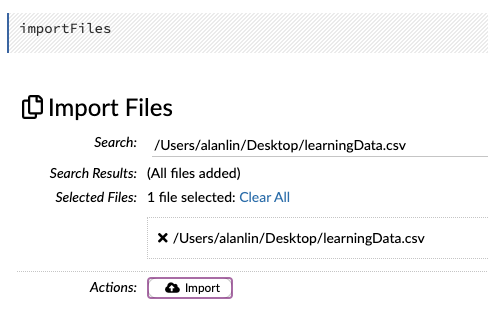
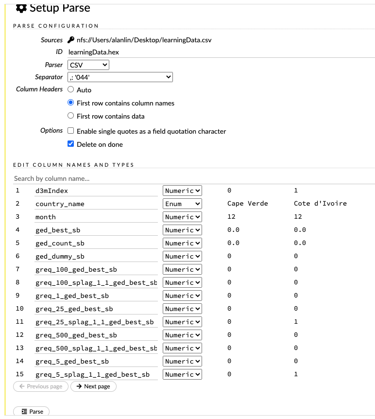
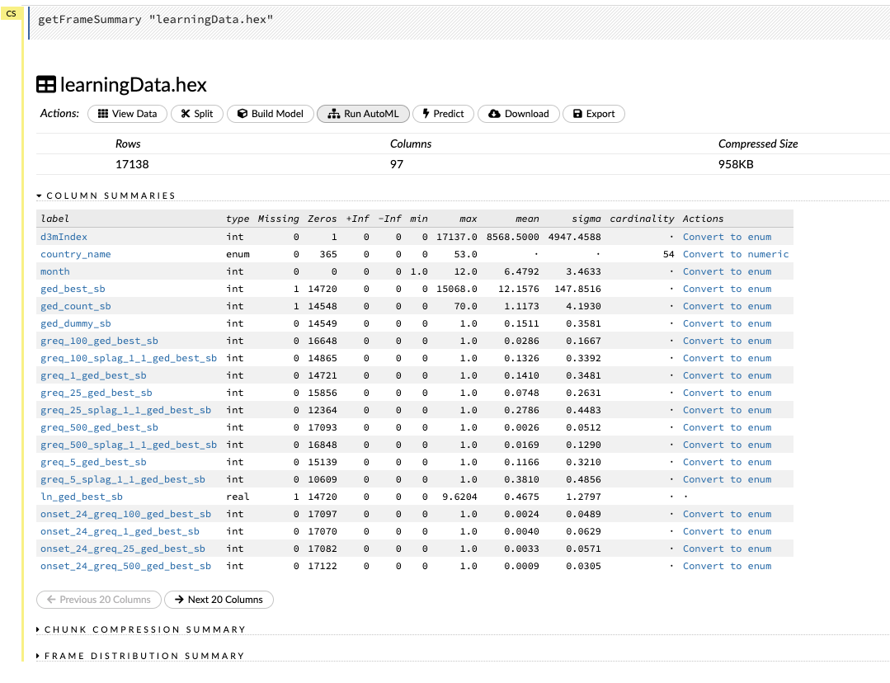
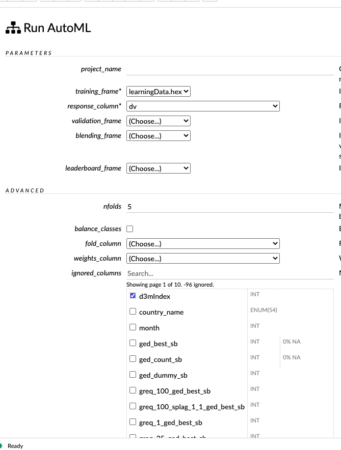
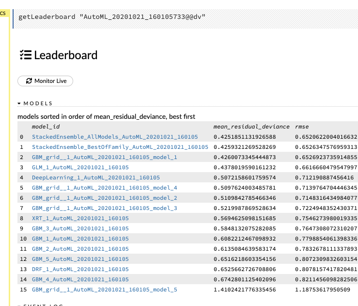
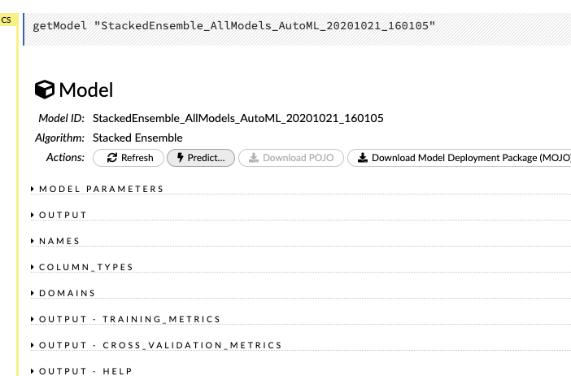

# Views Toolbox -- Code for *Forecasting Political Instability in Africa with Automated Machine Learning System*

# Requirement 

Make sure <a href="https://pandas.pydata.org/">Pandas</a>, <a href="https://numpy.org/">Numpy</a> and <a href="https://gitlab.com/ViDA-NYU/d3m/d3m_interface/-/tree/master/">d3m_interface</a> are installed.
*d3m_interface* is required for *AlphaD3M* and *CMU* AutoML engine only.

# Usage

First of all, some data files are required and you can obtain them from R code.

After `dv_cm(pgm).csv`, `raw_cm(pgm).csv` and `grid_conflict_count.csv` are obtained.
Modify corresponding lines in `/src/auxiliary/configuration_builder.py`.
For example, change `task_type`, `file_path`, `dv_file_path`, etc.
Moreover, please make sure that every slots in that file are correctly specified, you can refer to that src file for more information (It's well commented).

Run following code to generate configuration file:

    python3 configuration_builder.py 
    
Then run following code to generate filtered dataset:

    python3 vtb_v2.py --config test_config.json
    
You can find the generated dataset in the path you specified with following structure:

    -- GENERATED_DATASET
        -- TRAIN
            -- dataset_TRAIN
                -- tables
                    -- learningData.csv
                -- datasetDoc.json
            -- problem_TRAIN
                -- dataSplit.csv
                -- problemDoc.json
        -- TEST
            ...
        -- SCORE
            ...

Noted that `TRAIN`, `TEST` and `SCORE` folder share same structure. (Actually, it's not necessary for `H2O` AutoML engine)

# Training with *H2O*

Please download <a href="http://h2o-release.s3.amazonaws.com/h2o/rel-zermelo/1/index.html">H2O</a> and run it based on the instruction.

Open *H2O Flow* in the browser, the default url is `http://localhost:54321`

1. Choose *importFiles* button in the home page, upload `GENERATED_DATASET/TRAIN/dataset_TRAIN/talbes/learningData.csv`

2. Parse the uploaded csv file

3. Click *runAutoML*, set *training_frame* as the frame just parsed and set *response_column* as `dv`. In the `ignored_columns` block, check `d3m_index`, then click *Build Models*

4. (Optional) Follow steps 1-2 to upload a test split and predict it with the trained model. Export the prediction by clicking `export` button

